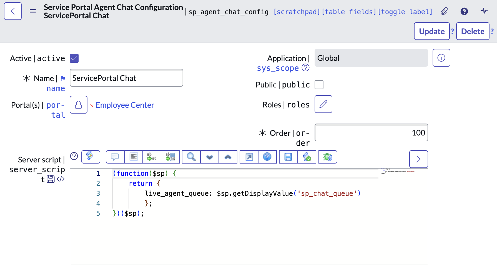

import { Agent } from 'http';
import { Steps } from 'nextra/components';

If you want to restrict the Virtual Agent widget to display only on certain portals (e.g. only on the Employee Center), you can do so by modifying your "Service Portal Agent Chat Configuration" (`sp_agent_chat_config`) record.

<Steps>

### Navigate to the "Service Portal Agent Chat Configuration" record

Go to **Service Portal > Agent Chat** in the menu and open the record that you created when you set up Virtual Agent.

### Add a portal

In the "Portals" field you can click the unlock icon to add one or more portals where you want the Virtual Agent widget to be displayed.

If you select no portals, the widget will be displayed on all portals.

</Steps>