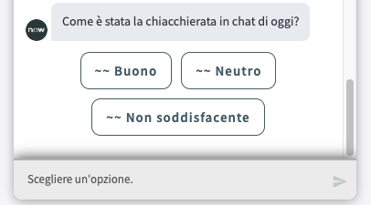
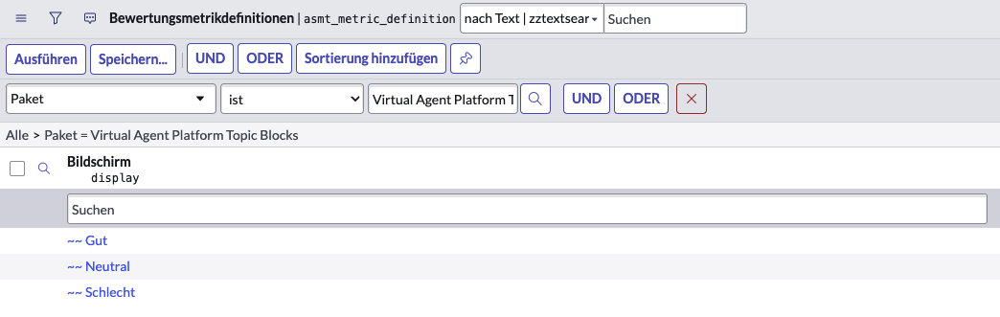
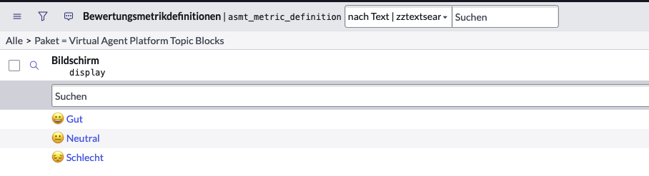

import { Steps } from 'nextra/components';

When you configure Virtual Agent to be multi-lingual and you choose to use the end-of-conversation survey, the emojis don't work.

You can solve this as follows:

<Steps>

### Navigate to the `asmt_metric_definition` table and filter by package

Navigate to the `asmt_metric_definition` table (`/asmt_metric_definition` with SN Utils).

Set up a filter to filter for the Package `Virtual Agent Topic Blocks`.

### Change your session language to the target language

The previous step will only display the records that correspond to your current session language. To edit the records from other languages, change your session language (`/lang <language code>` with SN Utils, or via the user preferences).

### Update the records

Here are the emoji characters that are used by ServiceNow by default:

😀, 😐, 😔

And here's the end result:

</Steps>
