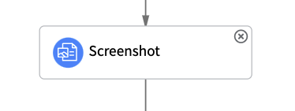

import { Steps } from 'nextra/components';

Attachments are not one of the standard input options when creating a record in a Virtual Agent Topic. However, you can use a script to add an attachment to a record. Here is an example of how you can do this:

<Steps>

### Add a File Picker component to your topic flow



### After the record creation, add a Script Action

Add the following script:

```javascript
(function execute() {
    vaSystem.attachToRecord(vaInputs.screenshot.getValue(), 'incident', vaInputs.incident_id);
})()
```

Where `screenshot` is the variable that stores the attachment, `incident` is the table name, and `incident_id` is the sys_id of the record you created.

</Steps>