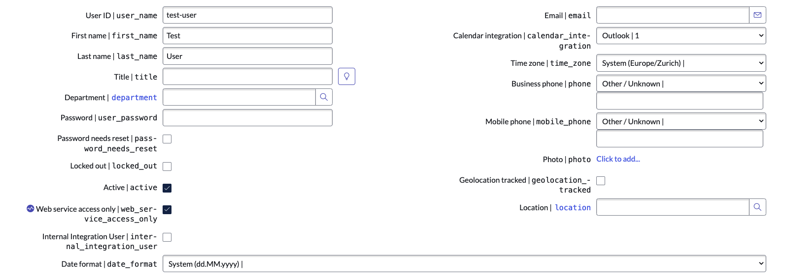
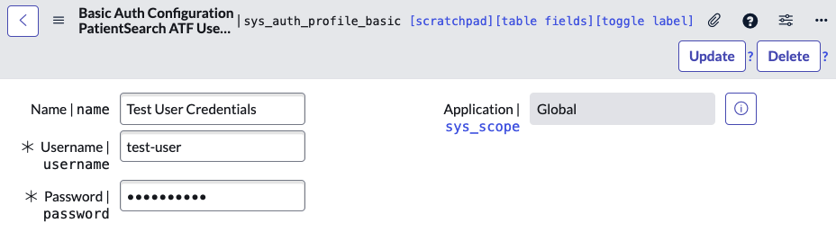
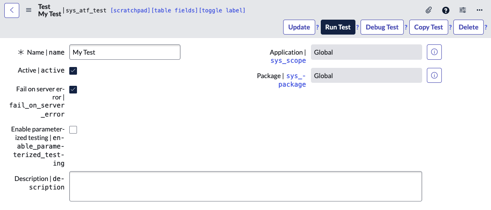

import {Steps} from 'nextra/components'

SOAP is a legacy protocol, but it is still used in many systems. Whenever I need to deal with a SOAP endpoint, I would like to be able to write some automated tests for it. It's not entirely self-evident how to do this, so here is a guide.

The overall approach is to create a dummy SOAP service on your instance and to use a Server Side ATF Script to swap out the endpoint of the SOAP message you want to test with the dummy service. This way you can test the SOAP message without actually sending it to the real endpoint.

<Steps>
### Create a new `sys_user` with a password and give them the `soap_script` role.

We need the user account to authenticate against the SOAP endpoint. When strict security is enforced on the instance, this user needs the `soap_script` role as well.

> When strict security is enforced on a system, the HTTP authenticated user must have the soap_script role to execute the scripted web service. — [Scripted SOAP Web Services (Official Docs)](https://docs.servicenow.com/csh?topicname=c_ScriptedWebServices.html&version=latest)

You can also set `web_service_access_only` to `true` to make sure the user can only access the web service.



### Store the username and password in a Basic Auth Credential

This step is a little trick to not have to store the password in the script itself. Instead we're going to store it in a credential, pull it from there in the script and decrypt it on the fly.

- Navigate to **Credentials & Connections > Credentials**
- Click **New**
- Select `Basic Auth Credentials`
- Fill in a `name`, `username`, and `password` and click Submit
- Finally copy the `sys_id` of the new credential for future use



### Create a basic SOAP service

In this step we're going to create the SOAP service that we're going to swap in for the real service.

- Navigate to **System Web Services > Scripted Web Services > Scripted SOAP Web Services**
- Click **New**
- Fill in a `name`
- **(Important)** Set the `function_name` to the value of the function you would invoke in the real service
- The `script` you can leave as is for now:
    ```javascript filename="sys_web_service.script"
    (function scriptedWebServiceOperation(request, response) {
        // Add your code here
    })(request, response);
    ```
- Click **Submit**

### Create a Server Script ATF Test

In this step we're going to create the Server Script ATF Test where we will perform the actual test. It's in this script that we'll pull in the credentials and swap out the endpoint of the SOAP message.

- Navigate to **Automated Test Framework > Tests**
- Click **New**
- Give your test a `name` and click Submit
    
- In the **Related Links** section click **Add Test Step**
- Select **Run Server Side Script**
- Click **Submit**
- Click on the newly created record with Display Name `Run Server Side Script`
- Remove all the boilerplate and add some basic scaffolding for a test:
    ```js filename="Run Server Side Script"
    (function(outputs, steps, params, stepResult, assertEqual) {
        describe('Test the SOAP message', function() {
            it('should do something', function() {
                // Add your test here
            });
        });
    })(outputs, steps, params, stepResult, assertEqual);
    jasmine.getEnv().execute();
    ```

### Grab the encrypted password from the basic auth profile

In this step we're going to retrieve the username and password we saved in the Basic Auth Credential in step 2.

- Modify your `Run Server Side Script` test to include the following code:
    ```js filename="Run Server Side Script"
    (function(outputs, steps, params, stepResult, assertEqual) {
        describe('Test the SOAP message', function() {
            it('should do something', function() {
                grBasicAuthProfile.get('YOUR_BASIC_AUTH_CREDENTIAL_SYS_ID');
                var username = grBasicAuthProfile.getValue('username');
                var encryptedPassword = grBasicAuthProfile.getValue('password');
                
                var Encrypter = new GlideEncrypter();
                var decryptedPassword = Encrypter.decrypt(encryptedPassword);
            });
        });
    })(outputs, steps, params, stepResult, assertEqual);
    jasmine.getEnv().execute();
    ```


### When you query the service swap out the endpoint on the SOAP message record


</Steps>

Make sure you set the function to something that you will use later.

## References

1. [Get an encrypted password from an auth profile](https://snprotips.com/useful-scripts)
2. [How to create an inbound scripted SOAP WebService](https://www.servicenow.com/community/developer-articles/article-5-how-to-create-an-inbound-scripted-soap-webservice-and/ta-p/2330074)
3. [Manipulating the XML](https://docs.servicenow.com/bundle/vancouver-api-reference/page/integrate/inbound-soap/task/t_CustomizeResponse.html)
4. [Scripted SOAP Web Services (Official Docs)](https://docs.servicenow.com/csh?topicname=c_ScriptedWebServices.html&version=latest)
5. [Appending child XML nodes](https://www.servicenow.com/community/developer-forum/building-nested-xml/m-p/2153604)
