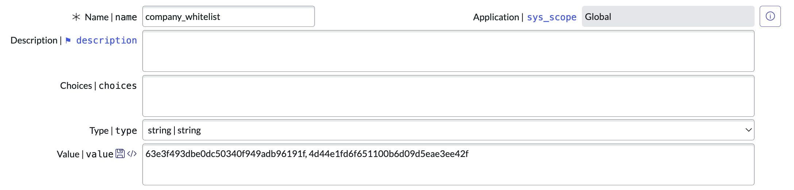

import { Steps } from 'nextra/components';

Sometimes you want to store (and later retrieve) an array of values in a single `sys_property` record. This is useful when, for instance, you want to display a UI action on `incident` records only for a whitelisted set of `company` records.

Storing this list as a `sys_property` has the added benefit that it can be edited by non-technical users and without the need for an update set.

Here's how it works:

<Steps>
### Store a comma separated list of values in a `sys_property`



### Retrieve the list of values from the `sys_property` and convert to an array

```js
var arr = gs.getProperty('your_property','[]')
    .split(',') // split the string into an array
    .map(String.trim); // remove any leading/trailing whitespace
```

You can use this in a UI Action `condition` like so to only display the UI action for `incident` records with a `company` in the whitelist:

```js
gs.getProperty('company_whitelist', '[]').split(',').map(String.trim).indexOf(current.company.toString()) > -1;
```
</Steps>
