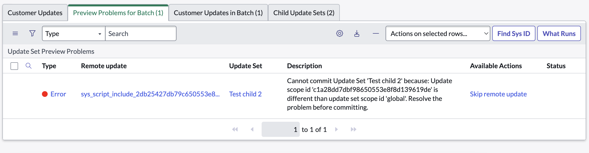

There is an issue that occurs with update sets in ServiceNow where, inadvertently, updates within a given scope are assigned to an update set in a different scope. I'm still unclear on how this happens precisely, but it seems to be a common issue.

Typically you'll notice this when you're trying to import an exported update set. The error looks something like this:

```
Cannot commit Update Set. Update scope id is different than update set scope id 'global'
```



It's particularly debilitating because the only action ServiceNow offers from this point is to `Skip remote update`, which is not what we want.

The solution to this problem involves creating new update sets with matching scope for the deviating updates. This can be a tedious process, especially if you have a lot of updates in the update set.

Paul Morris has [an article and a ServiceNow application](https://sn-nerd.com/2022/02/12/how-to-prevent-cannot-commit-update-set-issues-in-your-instance/) that you can install to notify you when this happens, and to rectify it _before_ you export your update set.

Paul's solution, however, doesn't work if you've already exported the update set and for whatever reason you don't have access to the instance / context from which the update set was exported. I was recently faced with a situation where the update set had already been exported and the instance from which it came had been wiped as part of a clone.

The only solution seemed to be to rectify the update set XML file itself.

I wrote a Python script designed to do just that. This results in an XML file that can be imported into an instance without the above error. You can find it on GitHub [here](https://github.com/BisonITS/fix-update-2-update-set-assignments).

It loops through the updates and update sets included in the XML and figures out what new update sets need to be created. It then creates those, adds them to the xml and updates the relevant updates to point to the new update set.
