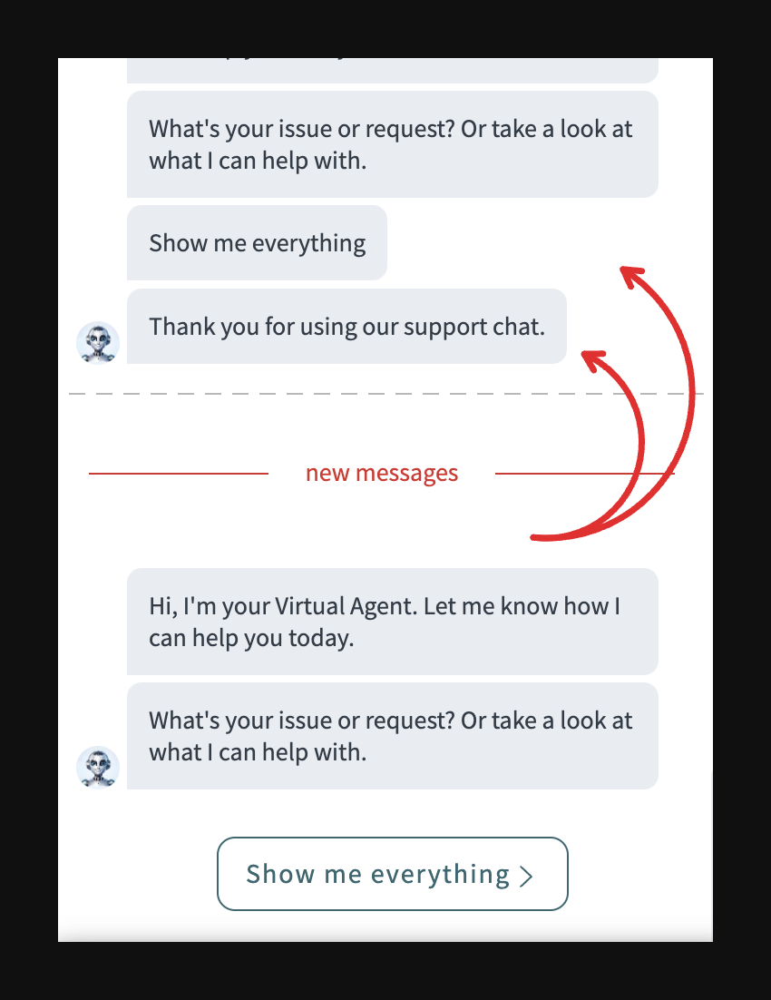

By default ServiceNow's virtual agent chat widget will display your chat history from previous sessions.



You can disable this feature by editing the `sp_widget` record itself with default name `Virtual Agent Service Portal Widget`.

There in the `client_script` field we edit how the `$ctrl.vaSource` property is set.

```javascript {8} filename="client_script" /&sysparm_skip_load_history=true/
$ctrl.toggleWindow = function () {
    if $(ctrl.isWindowVisible) {
        // Leave as is
    } else {
        if ($ctrl.firstPress) {
            // Leave as is
            // $ctrl.vaSource = '/$sn-va-web-client-app.do?sysparm_nostack=true&sysparm_stack=no';
            $ctrl.vaSource = '/$sn-va-web-client-app.do?sysparm_skip_load_history=true';
            // Leave as is
        }
    }
}
```
