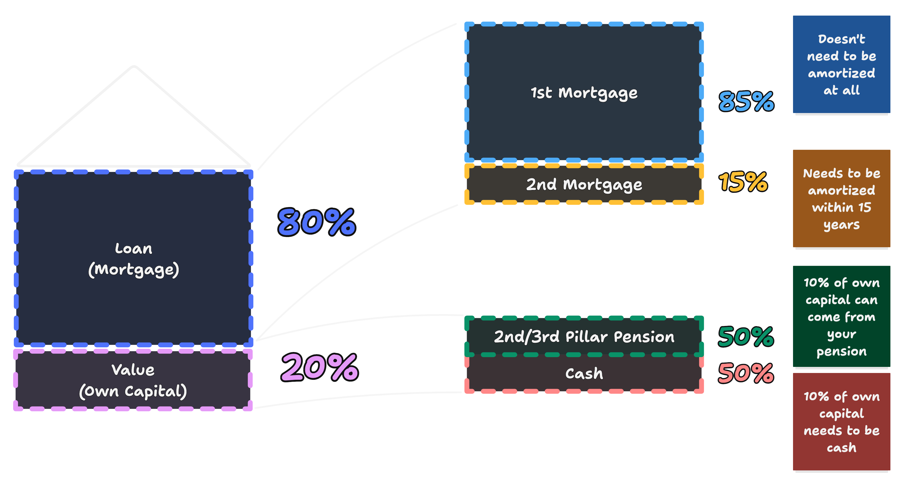

import YouTube from '@components/youtube';

<YouTube id="ug4tBLxw3bE" />

In 2024 my wife and I — two foreigners in Switzerland — bought a house in Ticino, Switzerland. It was a lengthy — and at times confusing — process. This article is a summary of what we wish we knew before we started the process.

## A mortgage

A mortgage is a loan to buy a house. Typically a bank give these loans to people they believe will be able to pay them back or — more common in Switzerland — indefinitely continue to pay the interest rate on the loan. The bank uses the house as collateral, so if you can't pay back the loan, they reserve the right to sell the house to get their money back.

By lending out money to you, banks are also incurring an [opportunity cost](https://en.wikipedia.org/wiki/Opportunity_cost). They could have left that money on their account with the central bank and earned interest on it. To make the mortgage business worth their while, they charge you an interest rate which is in proportion to (but slightly higher than) the interest they would have earned by leaving the money with the central bank.

To make sure banks don't take on excessive risks, the Swiss regulator (Swiss Financial Market Supervisory Authority) stipulates that people can only lend up to 4x the cash they have on hand. In other words, they can purchase a property with a ratio of up to 80% borrowed money and 20% of their own money. This is also known as the Loan-to-Value ratio (LTV) and is one of the two main factors the mortgage industry looks at when assessing the risk of making a loan (the other being Affordability, which we'll get to later). So if you can bring in 200'000 of your own cash, you can borrow up to 800'000 CHF.

If you have a chat with a bank or any mortgage advisor in Switzerland, they will all draw you a version of this chart, which starts with the 80-20 loan-to-value ratio on the left.

Although an 80-20 loan-to-value ratio requirement is high when compared to other countries, Switzerland is somewhat unique in that you are allowed to use your 2nd and 3rd pillar pension funds as part of your own funds (up to 10% of the total). You can do this directly, by withdrawing the money, or indirectly by pledging your second pillar.

The other factor the mortgage industry looks at, to assess risk, is known as the affordability. This is the ratio of your income to your projected monthly payments. Your monthly payments include interest payments (typically calculated at 5%), your amortisation payments and house maintenance costs. Your monthly projected payments cannot exceed 33% of your monthly income. In other words, the monthly costs of the house + mortgage cannot be more than one third of your income.

A mortgage in Switzerland typically consists of two sub-mortgages. The first mortgage, which is 15% of the borrowed sum, needs to be paid back (amortized) over 15 years or before retirement, whatever comes first. The remaining 85% can be paid back over longer, or more commonly, not at all. If you can bring in enough of your own funds to reduce the loan-to-value ratio to 66%, you can avoid the 2nd mortgage and the amortization requirement altogether.

Choosing not to pay back your mortgage sounded strange to me, but because the bank stands to earn quite a lot of money from your monthly interest payments over the lifetime of the mortgage, they're happy to let you do that. As an example, if you keep paying an interest rate of 2.5% for 29 years, you will have paid the full amount of the mortgage in interest payments alone.

When you're amortising your main mortgage, you have two options in Switzerland. You can choose to simply pay down the mortgage directly with the bank (direct amortization), or you can redirect your amortization payments into a 3rd pillar pension fund (indirect amortization), where your money is invested and where it may accrue yield. Shortly before retirement you can withdraw the money and pay off the mortgage.

## Mortgage advisors

In the Netherlands, where I'm originally from, it's common to work with independent mortgage advisors. They help you navigate the mortgage market and help you find the best deal.

It seems as though this is less established in Switzerland. There are some companies dedicated to providing mortgage advice, such as Moneypark and Hypohaus, but there aren't many. Most people seem to deal with their own bank, or procure offers themselves.

My wife and I obtained our mortgage through Moneypark. And although we aren't _unhappy_ with the service they provided, I wouldn't work with them again. You can read my full review [here](/posts/2024-07-29-an-honest-review-of-moneypark).

Hypohaus has glowing reviews online, but I had a bad experience trying to work with them. I emailed them, sent my documents, tried calling, them but never received a callback. Then several days later I received an email that they had shared my documents with other banks without ever contacting me. It might have been a one-off, but it left a bad impression.

In my view, a mortgage advisor is helpful to help you navigate the mortgage market. As a newcomer you don't know what you don't know. A mortgage advisor helps fill in those gaps. Ideally they also help you find a good deal.

Most mortgage advisors in Switzerland seem to work on a commission basis. They get a commission from the bank for every mortgage they sell. Moneypark also charges a fee for their services. I took this as a good sign, because it creates an incentive for them to not just sell the mortgage that provides them with the highest commission.

## Using your 2nd and 3rd pillar pension savings

Switzerland sets a relatively high bar for the amount of own money you need to bring to the table when getting a mortgage (20%). The silver lining is that you can use your 2nd and 3rd pillar pension savings towards this 20%.

Maximum half of the 20% own capital can come from the 2nd pillar. The other half can be 3rd pillar or any other cash you have on hand.

There are two ways of using your 2nd and 3rd pillar pensions. You can withdraw the money, or you can pledge it. Both options have benefits and drawbacks, but both are only available when your pension savings cross the CHF 25'000 threshold.

### Withdrawing your 2nd or 3rd pillar pension

| **Advantages**                                                   | **Disadvantages**                                                |
| ---------------------------------------------------------------- | ---------------------------------------------------------------- |
| Reduces your mortgage and thus your interest payments            | You lose the opportunity to accrue a yield with the pension fund |
| You can potentially invest the money where it earns higher yield | You have to pay a tax on the money you withdraw                  |
|                                                                  | You're reducing your pension savings                             |

The first benefit of withdrawing is that the money you take out can go directly towards reducing your outstanding mortgage. This can reduce your monthly interest payments.

The second benefit of withdrawing is that it might free up money to invest in other things at a higher yield. For instance, you could withdraw your second pillar and direct it towards your mortgage. Meanwhile this frees up your conventional savings, which you now don't have to put towards the mortgage, and are free to invest them however you want.

The first drawback of withdrawing is that you lose the opportunity to accrue a (comparitively low but safe) yield with the pension fund. The second drawback is that you have to pay a [tax on the money you withdraw](https://www.vermoegenszentrum.ch/finanzrechner-und-vergleiche/steuern-auf-kapitalbezuege-aus-der-2-saeule-oder-saeule-3a). The third drawback is that you're reducing your pension savings, which might not be a good idea if you're close to retirement.

### Pledging your 2nd or 3rd pillar pension

An alternative is pledging your 2nd pillar rather than withdrawing it. This means you sign a contract with the bank which empowers them to assume ownership of your pension savings if you can't pay back the mortgage. To account for the risk involved, the bank typically counts the 2nd pillar as 90% of its value. So if you have 100,000 CHF in your 2nd pillar, the bank will count it as 90,000 CHF to account for the risk.

Typically after a couple of years of paying down the mortgage, the bank will have received enough money to reduce the risk of the mortgage to a level where they no longer need the pledge on the 2nd pillar. At this point they will release the pledge and you will have access to the full amount of your 2nd pillar again.

The main benefit of this approach is that your money can continue to accrue yield in your pension fund, although these yields are typically comparatively low.

One drawback is that you're stuck with the comparatively low yield that your pension fund offers. Another drawback is that you're not reducing your monthly mortgage payments. After all, the outstanding mortgage amount remains the same, so the interest payments don't change. A third drawback is that the money isn't counted as your money, instead the bank is able to offer a mortgage at a 90-10 loan-to-value ratio. Tax deductions also have a role to play, but I'm not informed enough to comment on the topic.

Our bank (UBS) told us that typically all that is necessary to establish the pledge is the bank sending a letter to your pension fund with a copy of the pledging contract. In our case, though, both our pensions funds had additional requirements. For example, we both needed to provide a copy of the certified pruchase contract of the house.

| **Advantages**                                                            | **Disadvantages**                                                  |
| :------------------------------------------------------------------------ | :----------------------------------------------------------------- |
| Your money continues to accrue yield in your pension fund                 | You're stuck with the comparatively low yield of your pension fund |
| The bank can offer you a mortgage at a higher (90-10) loan-to-value ratio | You're not reducing your monthly mortgage payments                 |
| You don't pay any tax on the money you pledge                             | Your money only counts for 90% its value                           |

We didn't like the idea of paying a tax on our 2nd pillar withdrawal. We also didn't mind paying higher interests costs due to the higher loan-to-value ratio associated with a pledge. Lastly, because we had no plans or ideas about investing the 2nd pillar pension funds elswhere, where it could generate a higher yield, the pledging option seemed a much better choice for us.

## Amortization (Paying back the mortgage)

Amortization is the paying back of your mortgage. Remember that a typical mortgage in Switzerland consists of two sub-mortgages. One, which is 15% of the borrowed sum, which you are required to amortize in 15 years. The second, which is 85% of the borrowed sum, which you are not required to amortise at all (as long as you keep paying the interest payments)

### Direct amortization

This is the classical way of paying back your mortgage. You simply pay down the outstanding loan with the bank. This has the benefit of reducing your monthly mortgage payments. The drawback is that you're not accruing yield on the money you're paying back. I cannot speak to this type of amortization too much, because we opted for indirect amortization.

### Indirect amortization

Another fairly unique feature of the Swiss system is that you can opt for amortizing (paying back) your mortgage, by paying into a 3rd pillar pension fund. This is known as indirect amortization.

The benefit of this approach is that your money continues to accrue yield in a 3rd pillar pension fund. You can even choose a 3rd pillar provider and a fund that you believe will give you the best return. The idea is that when you reach retirement age, your 3rd pillar funds will have accrued enough to pay off the mortgage and then some. One drawback is that the yield is not guaranteed if you're investing in the stock market, for instance. Another drawback is that you're not paying down the outstanding loan, so you're not reducing your monthly mortgage payments.

We chose our mortgage through Moneypark and the way they pitched the indirect amortization was that over longer time frames index funds have historically outperformed typical pension fund yields. They showed us a graph that had some single or multi-year dips, but over the long term offered a 7% yield.

## Interest rates

Interest rates are the price of lending money. They're influenced by the interest rates bank themselves get for storing money with the central banks. As a consequence, the interest rate of the Swiss National Bank and the European Central Bank are important factors that determine the interest rate your bank is able to offer you.

-   https://www.leitzinsen.info/schweiz.htm
-   https://www.euribor-rates.eu/en/euribor-charts/

### Fixed interest rate mortgages

Typically people get a mortgage with an interest rate which is fixed at a certain rate for a given amount of time (e.g. 5, 10 or 20 years). This gives you security in knowing what your monthly payments will be irrespective of what the market does. You pay for this security in the form of a slightly higher interest rate. So the longer you fix your interest rate, the higher the interest tends to be.

### SARON mortgages

SARON (Swiss Average Rate Overnight) is a relatively new variable interest rate which was introduced to replace the LIBOR rate. The LIBOR rate is being phased out because of a scandal where banks were caught manipulating the rate. The SARON rate is calculated based on the interest rates banks pay for overnight loans. So in essence, it's an interest rate that tracks the market.

The benefit of a SARON mortgage is that the interest rate is typically lower than a fixed interest rate mortgage. The drawback is that the interest rate can change. So if the SARON rate goes up, your monthly payments will go up. If the SARON rate goes down, your monthly payments will go down.

It's worth noting that historically, over longer time spans, SARON outperforms fixed interest rates. So if you have an appetite for the risks involved (i.e. interest rates going up considerably), it's plausible you'll end up paying less with a SARON mortgage.

### Variable rate mortgages

Variable rate mortgages are similar to SARON mortgages, but the interest rate is set by the bank. The bank can change the interest rate at any time. The main benefit of a variable rate mortgage is that you can typically pay it back at any time without incurring a fee. So people typically go for this option if they know the mortgage is only temporary. The drawback is that the bank can change the interest rate at any time.

You probably won't see the exact calculation.

-   https://www.vermoegenszentrum.ch/finanzrechner-und-vergleiche/aktuelle-hypothekarzinsen-im-vergleich
-   https://www.moneyland.ch/de/hypo/list

## Documents needed

When applying for a mortgage, you'll need to provide a number of documents. Here's a list of documents we ended up needing:

#### Sales documentation with 7-10 photos

(interior and exterior view incl. kitchen, bathroom and living room)
Got this from our real estate agent.

#### Building insurance certificate (incl. indication of m3 and year of construction)

Our house was in Ticino and wasn't insured (in Ticino this is not required), so we couldn't provide this.

#### Land register extract (not older than 6 months) (_Grundbuchauszug_)

Got this from our real estate agent.

#### Floor plan (incl. gross / net living space) (_Grundrisspläne_)

Got this from our real estate agent

#### Land purchase contract / reservation contract (draft if necessary) (_Kaufvertrag / Reservationsvertrag_)

    We were not near a purchase, so didn't provide this.

#### Listing of renovations in the last 20 years (what / when / amount)

    We didn't have this.

#### Condominium owner regulations (_Stockwerkeigentumsreglement_)

    This wasn't relevant to us because we bought a detached house.

#### Usage and management regulations (_Nutzungs- und Verwaltungsordnung_)

    Same as above, wasn't relevant to us.

#### Quote for all the planned renovations

    Our bank, UBS required this.

#### Draft contract for the house purchase

    Our bank, UBS required this.

## Miscellaneous

### Additional requirements by UBS

Signing with UBS came with two additional requirements. The first was signing on for a life insurance policy with death coverage only. I think this required because my wife's salary isn't high enough to cover the mortgage payments by herself. The seond requirement was moving my main checking account to UBS.

### Primary / Secondary residence in Ticino

I'm not sure how this works in the rest of Switzerland, but at least in Ticino many properties are owned by people who have the property as a secondar residence i.e. a vacation home.

When you're buying a property in Ticino, however, not all locations will allow a secondary residence. Some communities don't allow secondary residences. This is because the local government wants to ensure that there are enough properties available for people who actually live in the area.

We saw a small property with an astounding view of the lake from the top of Carona, which was still on the market because only a primary residence was permitted. Yet, the property was very small and comparatively expensive for a primary residence.

### Mortgage for renovations

It's not uncommon to take out a larger mortgage than the purchase price of the house to finance renovations. This is known as a renovation mortgage. The bank will typically require you to provide a quote for the planned renovations. Also the total mortgage amount still needs to be within the 80% loan-to-value ratio and the 33% affordability ratio.

We took out a CHF 72'000 renovation mortgage to finance the renovation of our house on top of our 470'000 mortgage.

### Can you sell the house

When you sell your house and repay your mortgage, you may be subject to a capital gains tax. This tax is intended to discourage quick property flips and speculative resales. While I haven't reviewed the specific legislation, my understanding is that the tax is calculated as a percentage of the profit made from the sale.

You can avoid this tax entirely if you use the money to buy another property. You can also talk to your bank to transfer your mortgage to the new house, if you don't want to pay it back at that point.

### Renting out the property

Swiss citizens and C permit holders can rent out their property and live elsewhere. B permit holders are not allowed to rent out their property and the property needs to be their primary residence. The law that stipulates this seems to be [article 18a](https://www.fedlex.admin.ch/eli/cc/1984/1164_1164_1164/de) of the Lex Koller law.

Although it doesn't stipulate explicitly that B-permit holders cannot rent out part of their primary residence, it seems that this is left to the discretion of the cantonal authorities, who typically don't allow it.

Here's what [one law firm](https://www.vischer.com/know-how/blog/grundstueckserwerb-durch-auslaenderinnen-und-auslaender-39090/) has to say on the matter:

> An important exception to mention is the purchase of a primary residence. A non-EU/EFTA citizen residing in Switzerland (usually with a residence permit B) can acquire a dwelling (single-family house or condominium) at their actual place of residence without requiring a permit. The acquiring person must live in the dwelling themselves; subletting, even partially, is prohibited. The area of the property must not be so large that part of it could be considered a mere capital investment. For properties with an area of 3,000 m² or more, the land registry office usually refers the acquiring person to the permit authority.

### Paying back the mortgage early

The bank is interested in getting a predictable income stream from your mortgage. If you pay back the mortgage early, they lose out on the interest payments they would have received. To make up for this, they typically charge a fee for paying back the mortgage early. This fee is determined by how much money the bank is set to lose (or gain) by you paying back the mortgage early.

If you've fixed your interest rates at a relatively low rate, and the interest rates rise, you might not pay a fine at all to dissolve your mortgage, because the bank can lend out the money to someone else at a higher rate.

If, however, the interest rates go down, the bank would lose money if they lend out your mortgage amount at a lower rate. In this case, you would have to pay a fee to dissolve your mortgage, which (I've been told)is roughly the total interest payments still outstanding.

As with the tax on selling the house, you can avoid this fee entirely if you transfer the mortgage to a new property.

### Revaluing the house and increasing the mortgage

We bought our house under the market value. Technically this means that our share of the house is worth more on paper than we paid for it. So that means we could recalibrate our loan-to-value ratio to take out an even bigger loan.

This is an established practice, but you can't do it straight away. Our bank, UBS, told us they will only revalue the property after 2 years.

## Resources

-   https://thepoorswiss.com/mortgages-in-switzerland/

<link rel='canonical' href='https://forum.mustachianpost.com/t/mortgages-in-switzerland-what-i-wish-i-knew/13500' />
