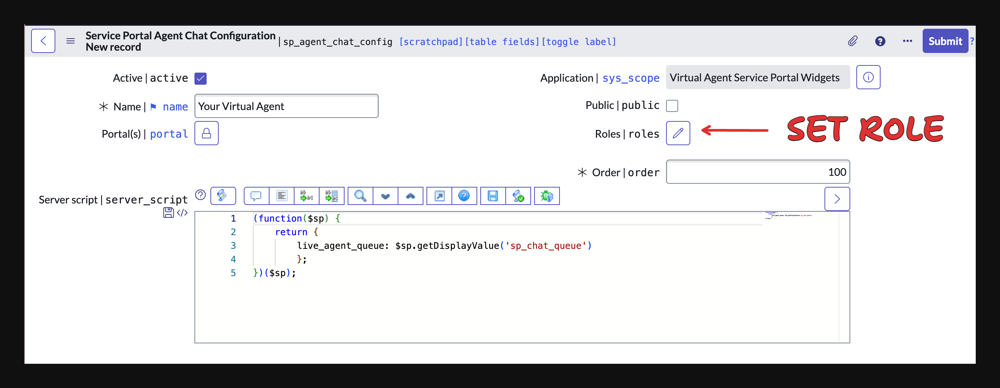
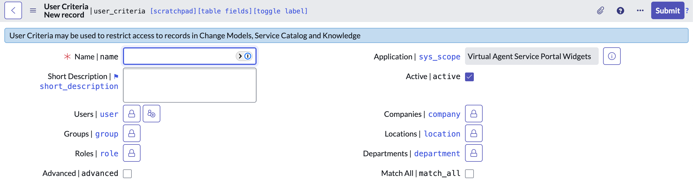

Out-of-the-box ServiceNow offers a way to selectively display the Virtual Agent widget by user role. (Sometimes this isn't enough, and we'll get to that after this). This is done on the `sp_agent_chat_config` record which is also used to add the Virtual Agent to one or multiple portals.

When you want to restrict the access in a different way, like by group or by user, you can navigate to the `sp_widget` record itself (`sn-va-sp-widget`), and set up a `Can View` [User Criteria](https://docs.servicenow.com/csh?topicname=user-criteria.html&version=latest).

import Steps from 'nextra/components'

<Steps>
## Navigigate to the related lists on the Virtual Agent `sp_widget` record

Navigate to the `sp_widget` table and search for the widget with `ID` `sn-va-sp-widget`. Open the record and navigate to the related list section. Click the `Can View` tab and click `New`.

## Create a new User Criteria

Create a new User Criteria by group, user, or some other criteria of your choosing. Then save the record and you're all set.
</Steps>