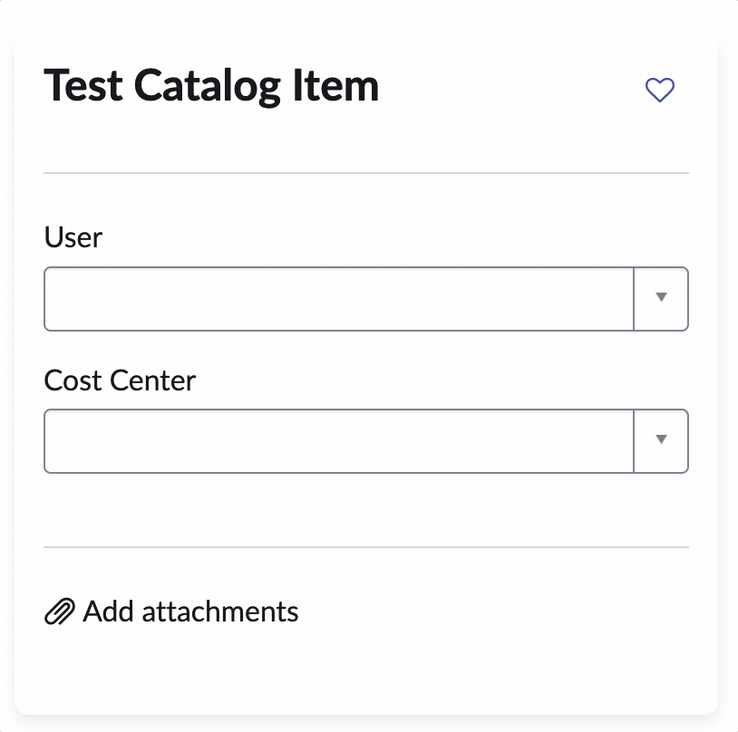

There's a common use case where you want to populate one or multiple fields in a catalog item based on the value of another field.

For instance, you want the user to select a user, and based on that user you want to populate the cost center, department, and location fields.

If you google this, you will find different answers. The only way to do this used to be with a catalog client script and using AJAX. After that there was a way to accomplish it with a catalog data lookup.

As of this writing, it's become much easier, you can simply use ServiceNow's "Autopopulate" feature, which is accessible from the Catalog Builder or from the classical UI.

