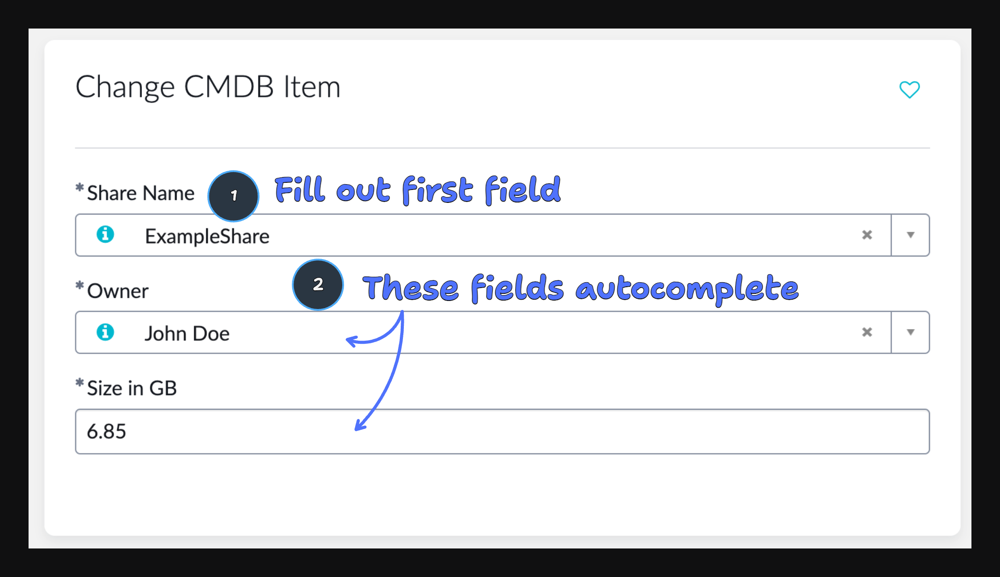

## Requirement



You've got a catalog item with one or more fields. One or more of these fields is autopopulated, either on `onLoad` or `onChange` of one of the other fields. You want to make sure that the user can only submit a form if they've actually changed one of the autopopulated fields.

A practical example of this is where you have a catalog item for changing `cmdb_ci` records. The first field of the catalog item is the `name` field. Once selected, the other properties of the corresponding `cmdb_ci` record are autopopulated. You want to disallow any form submissions where no changes have been made.

## Recommend approach: Scripting your own autopopulation logic while caching the value in `g_scratchpad`

_For a discussion of the pros and cons of other approaches, see sections below this one._

The basic idea here is to _not_ configure the OOB `Autopopulation` tab on the Catalog Item (even though it's a great feature) and instead to write your own autopopulation logic using `GlideAjax`. This way when you receive the response from the server you can also update `g_scratchpad` with the new values. When the user reaches `onSubmit` you can cross reference the form field values with what is stored in `g_scratchpad`. Since you can script the autopopulation logic in such a way that you always return a value for each field, you don't run into any of the issues you run in to in approach 2.

```js filename="sys_script_include/BiHaGetRecordFields"
var FieldValueRetriever = Class.create();
FieldValueRetriever.prototype = Object.extendsObject(AbstractAjaxProcessor, {

    getRecordFieldValues: function () {
      var tableName = this.getParameter('sysparm_table');
      var sysId = this.getParameter('sysparm_sys_id');
      var fields = this.getParameter('sysparm_fields');

      var gr = new GlideRecord(tableName);
      if (!gr.get(sysId)) {
        return '{}';
      }

      var result = {};
      fields.split(',').forEach(function (field) {
        result[field] = gr.getValue(field) || '';
      });

      return JSON.stringify(result);
    },

    type: 'FieldValueRetriever'
});
```

```js filename="catalog_script_client/onLoad"
function onLoad() {
	g_scratchpad.dependentFields = [
		'owned_by',
		'name'
	];
	g_scratchpad.noChangesMessage =
		'No changes were submitted. Please update at least one field before submitting.';
}
```

```js filename="catalog_script_client/onChange (target field)"
function onChange(control, oldValue, newValue, isLoading) {
	console.log('newValue: ', newValue);
	if (isLoading || newValue == '' || newValue == null) {
		return;
	}

	// Validate required scratchpad data
	if (!g_scratchpad.dependentFields || !Array.isArray(g_scratchpad.dependentFields)) {
		console.error('Required dependentFields not found in g_scratchpad');
		return;
	}

	var formKeyValues = {};
	g_scratchpad.dependentFields.forEach(function (field) {
		formKeyValues[field] = g_form.getValue(field);
	});

	var ga = new GlideAjax('FieldValueRetriever');
	ga.addParam('sysparm_name', 'getRecordFieldValues'); // Add missing method name
	ga.addParam('sysparm_table', 'your_target_table');
	ga.addParam('sysparm_sys_id', newValue);
	ga.addParam('sysparm_fields', Object.keys(formKeyValues).join(','));

	ga.getXMLAnswer(function (response) {
		if (!response) {
			console.error('Server response is empty');
			throw new Error('Empty response from server');
		}

		var responseObject = JSON.parse(response);

		if (!responseObject || typeof responseObject !== 'object') {
			console.error('Invalid response format:', responseObject);
			throw new Error('Invalid response format');
		}

		// Autopopulate dependent fields
		g_scratchpad.dependentFields.forEach(function (field) {
			if (responseObject.hasOwnProperty(field)) {
				g_form.setValue(field, responseObject[field]);
			} else {
				console.warn('Field not found in response:', field);
			}
		});

		// Store autopopulated field values for later comparison
		g_scratchpad.autopopulatedFieldValues = responseObject;
	});
}
```

```js filename="catalog_script_client/onSubmit"
function onSubmit() {
	for (var i = 0; i < g_scratchpad.dependentFields.length; i++) {
		var field = g_scratchpad.dependentFields[i];
		var currentValue = g_form.getValue(field);
		var originalValue = g_scratchpad.autopopulatedFieldValues[field];

		if (currentValue !== originalValue) {
			return true;
		}
	}

	getMessage(g_scratchpad.noChangesMessage, function (message) {
		g_form.addErrorMessage(message);
	});

	return false;
}
```

| Advantages | Disadvantages |
|------------|---------------|
| ✅&nbsp;&nbsp;1 call to the server | ❌&nbsp;&nbsp;Logic spread across server and client side |
| ✅&nbsp;&nbsp;Low complexity solution | ❌&nbsp;&nbsp;Cannot use OOB Autopopulate feature |

## Discussion of alternative approaches

There are three alternative approaches to this problem. Each has its own set of advantages and disadvantages. 

### Approach 2: Making a server-side call with GlideAjax in `onSubmit`

The basic idea here is to make a call to the server side to retrieve the current values of the fields that are being submitted. If the values match, the submission should be aborted.

There are a couple of issues with this approach.

The first issue is that you cannot make synchronous GlideAjax calls in a catalog client script. The system's execution context will not wait inside the `onSubmit` script for the response from the server side. 

[ServiceNow's solution](https://support.servicenow.com/kb?id=kb_article_view&sysparm_article=KB0783579) to this is to make the call asynchronously anyway, but instead of connecting the result to the return value of `onSubmit` you store it (or its validity) in `g_scratchpad`. Then, when the asynchronous call completes, you resubmit the form in its callback. 

Then, upon the second submission, onSubmit will check for the value in `g_scratchpad` and if it's there, it will submit the form properly.

```js filename="catalog_script_client/onSubmit"
  function onSubmit() {
    if (g_scratchpad.isFormValid){
      return true;
    }

    var actionName = g_form.getActionName();
    var ga = new GlideAjax("SOMEFUNCTION");

    ga.addParam(.....);

    ga.getXML(function() {
      g_scratchpad.isFormValid = true;
      g_form.submit(actionName);
    });

    return false;
  }
```

There are a couple of ugly things about this. The first is that if you choose to make a server side call, ideally you don't want to mix that approach with an approach where you rely on client side variables such as `g_scratchpad`. In this case we're forced to mix both client and server side approaches.

The second part that is ugly is that you're forced to make a submission which you subsequently cancel and in some cases re-submit. This is not obvious logic to anyone that's not familiar with ServiceNow's workaround.


The main advantages and disadvantages of this approach are:

| Advantages | Disadvantages |
|------------|---------------|
| ✅&nbsp;&nbsp;Able to use the Autopopulate feature | ❌&nbsp;&nbsp;Weird hacky solution |
| ✅&nbsp;&nbsp;ServiceNow endorsed approach | ❌&nbsp;&nbsp;Logic spread across server and client side |
| | ❌&nbsp;&nbsp;2 server calls necessary |

### Approach 3: Tracking changes on the client-side with `g_scratchpad`

The basic idea here is as follows:

1. Autopopulate the dependent fields on `onChange` of the field that is being changed. Keep track of what the autopopulated values are in the client side variable `g_scratchpad`.
2. On `onSubmit` check the current form field values against the `g_scratchpad` values. If they match, disallow the submission.

This approach isn't feasible when the autopopulated fields can be empty, but it could work in simpler use cases.

The current best practice way of autopopulating fields is by configuring the `Autopopulate` tab on the catalog item record. This will invoke a REST API call on every change of the target field, which will load the values of the dependent fields. This is easy to set up and works well, however there is no easy way of hooking into this process to update `g_scratchpad`.

You could manually invoke a call to the server side via GlideAjax, so that you would have access to the returned values, and then update `g_scratchpad` with these values. However, I find using GlideAjax clunky, so I try to avoid it.

It may sound like you could find a hacky way to store the autopopulated values after the OOB autopopulation has run, but I've not found a comprehensive way of doing this. Tracking the autopopulated values in `g_scratchpad` as they are loaded into the fields, works. But as soon as you're dealing with fields that can sometimes be autopopulated _without_ a value, you'll find that the corresponding `onChange` event doesn't fire. This means you cannot use the fields' `onChange` events to reliably update `g_scratchpad` for all fields. And if you cannot reliably know what the autopopulated field values were, you cannot reliably check if the user has changed them on `onSubmit`.

You might think you can get around this by retrieving the field values after all the autopopulations have run. But how do you reliably know when that is? You could wait for a specified amount of time after the target field has been changed, but there's no way of knowing whether one of the fields is still loading.

| Advantages | Disadvantages |
|------------|---------------|
| ✅&nbsp;&nbsp;Able to use the Autopopulate feature | ❌&nbsp;&nbsp;Not feasible for fields that can be empty |
| ✅&nbsp;&nbsp;Logic localized (client-side) | ❌&nbsp;&nbsp;Higher complexity solution |
| ✅&nbsp;&nbsp;Only 1 call to the server |  |

### Approach 4: Storing the values in hidden fields

A third approach which is sometimes mentioned in the ServiceNow community forums is to autopopulate the fields into hidden fields alongside the visible fields. When the visible fields are changed, the hidden fields remain unchanged, which would allow you to make a comparison on `onSubmit`.

Relying on hidden fields feels disgusting here and it also doesn't scale well when you have many fields that are autopopulated. You would need a hidden field for each.

Moreover you cannot simply `getValue()` of a hidden field. You need to load the field as a normal field and hide it `onLoad`.

| Advantages | Disadvantages |
|------------|---------------|
| ✅&nbsp;&nbsp;Able to use the Autopopulate feature | ❌&nbsp;&nbsp;Not scalable |
| | ❌&nbsp;&nbsp;Low levels of obviousness aka high complexity |

## References

[Simple lookup via g_scratchpad](https://www.servicenow.com/community/developer-forum/client-script-on-submit-with-ajax/m-p/2460348)
[How to do async validation in an onsubmit client script](https://support.servicenow.com/kb?id=kb_article_view&sysparm_article=KB0783579)
[Tracking the AJAX call in g_scratchpad](https://www.servicenow.com/community/developer-blog/how-to-async-glideajax-in-an-onsubmit-script/ba-p/2279303)
[Use getXMLAnswer](https://www.servicenow.com/community/itsm-forum/on-submit-validation-using-glideajax-in-sp/td-p/2757821/page/2)