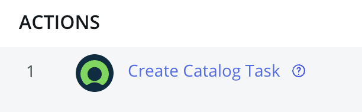
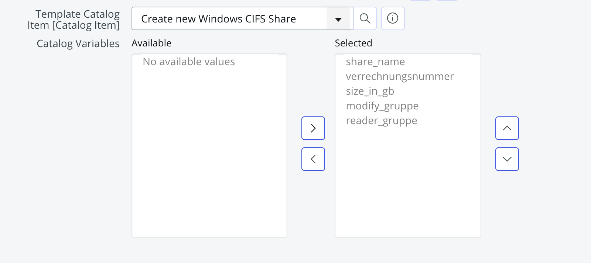
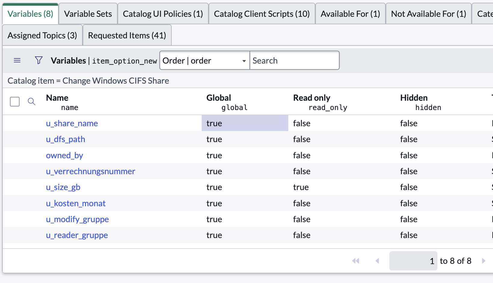

## Requirement

You've defined some variables on a catalog item and you've connected the catalog item with a flow. You want the catalog item to generate a catalog task (`sc_task`) and you want the variables defined on the catalog item to be available in the catalog task.

## Solution

1. Use the `Create Catalog Task` action in Flow Designer to create the catalog task.
   
2. Select the `Template Catalog Item` to correspond to the catalog item that will be used to create the catalog task. Then select whatever `Catalog Variables` you want from the slushbucket.
   
3. On the variable definition set the `global` field to `true` (hidden and `false` by default). Failing to do this will result in the variables being visible on the requested item, but not on the catalog task.
   
