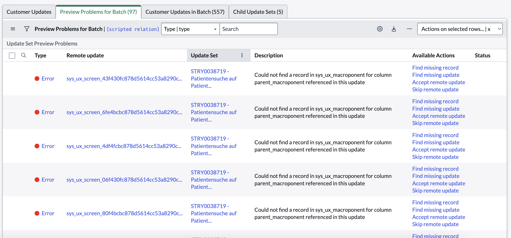

UI Builder is a no-code/low-code visual editor to build and edit ServiceNow's modern rendition of pages on their platform. At its core, this holds big promise. Company's keep all their business logic in ServiceNow, if you can offer an easy and accessible way of tailoring the user experience that runs on top of that business logic — that's a very powerful promise.

Not only is it a powerful promise, I imagine it's also an engineering challenge of monumental proportions.

The idea of a WYSIWIG editor is that it allows you to make changes to the code that generates a given UI, by making changes to layer which resembles the UI itself.

It is asssumed that this doesn't make the implementation more complicated.

The curious observation is that although a UI builder is puportedly targeted at non-technical users, the people that have been nudged forward to deal with it, are in fact, on measure, the _most_ technical people at our company.

At the same time, the ideal development paradigm for such highly technical people is not a WYSIWYG UI Builder. It is code, with documented APIs and plenty of observability, coupled with a performant hot-reload functionality to instantly view the results of your changes in the UI.

Consider adding a button to the menu. Arguably the most canonical example for any UI-builder-type of application. I think it's reasonable to say that we should expect this to be relatively straightforward for any visual editor for user interfaces.

However, it is not. Here are the steps you need to take:

```md
1. Create a `sys_declarative_action_assignment` record
2. Within that record create a `sys_declarative_action_payload_definition`
3. Make an educated guess which `sys_ux_form_action_layout` record is associated with the page where you want your button to show up
4. (You might need to switch scopes at this point)
5. Within that record add a related `sys_ux_m2m_action_layout_item` record
6. Set the table field to the table where you want your button to show up
7. Within the same record create a new `sys_ux_form_action`
8. Link that record to your original `sys_declarative_action_assignment`
```

First of all, let me note that all these steps are steps taken outside of UI Builder. Yes, you can add a random button component to a page in UI Builder, but if you want it to appear in the menu, the above route is the way to do it. This is a recurring pattern when using UI Builder: a bunch of UI-related stuff needs to happen outside of it.

Secondly, notice the degree of complexity involved. Not only are there a lot of steps, not only did we need to take those steps outside of UI Builder, but a whole world of abstractions has leaked into our experience from somewhere else. The user is expected to know and think about "declarative actions", "form action layouts", "layout items" and "form actions".

There are plenty of other required, yet easily overlooked, settings along the way. If you configure one of them incorrectly, there is no warning, no logs — nothing. The button just doesn't show up and all you can do is retrace your steps and try every permutation of settings until it works.

If that's not difficult enough, I'm not finished yet. If you want any more context as to how these records interrelate, what they do, what the binding philosophy is. You've in bad luck. This whole framework does not appear in the official documentation. The best you can get are community forum posts, which tend to describe _how_ to do things, but not _why_ things are the way there are. But it is pricesly by understanding the why of a framework, that makes it easier to start to run with it.

If you want your button to open a modal, you need add certain properties to the payload. Payload properties constitute the API and typically these things are documented thoroughly in API specifications. For whatever reason these APIs are not documented by ServiceNow.

A similar thing can be said about the components that you can drag and drop into UI builder. You might expect that when using the list component, you would able to plug in any list i.e. a javascript array of objects. No such luck. All components are closed source.

UI builder is not only extremely complex and poorly documented, it's worst quality is that it is unstable. There are various serious failure modes that occur on a regular basis. The other day I noticed that upon saving a script, multiple other scripts were being reset to a previous state. A few weeks ago I spent hours debugging a situation where the script which was shown as existing within my UI Builder page, was actually not part of the page. Behind the scenes an older version of that script, inaccessible through the UI, was still running the show. Another bug that has occurred regularly is that after making a change, UI Builder doesn't seem to recognize that a change was made, and keeps the "save" button disabled.

These types of bugs are incredibly difficult to report. After losing many hours figuring out what is happening to my application, I have little motivation to spend even more time figuring out how to reliably reproduce it.

Even the most senior developers at my company are afraid of UI Builder.

Visual UI Builders do exist and they're a legitimate category. When done well they tailor to people that don't have the time or ability to understand the world of code, but understand the world represented by the UI layer, and with minimal learning they are able to manipulate the appearance and behavior of the application, without doing this through code.

Performance is also poor.

This goal has all but completely been missed by ServiceNow's UI Builder.

If instead you focus on the experience of the developer, the format that has emerged as the go to way, is local development with a hot reload server, showing you in real time what effect your code changes have on the UI.

Instead of merging the input (code) and output (UI) worlds into an editable layer that closely resembles the UI, but where changes are translated into code, the approach is to let those two worlds live alongside one another. Instead, the worlds are kept separate. Resources are spent improving the speed of refresh.

UI Builder also doesn't strike me as very future proof. The shift in development with AI-enhanced development has been to put the developer into an architectural role, where they orchestrate the development through natural language. It's hard to overstate how productive developers have become.

At the same time, the paradigm is still hit and miss. The developer is transformed into an orchestrator, but the AIs output needs to be audited at the level of code. It's simply part of the paradigm. Load context > provide a question > audit suggested change > accept. It's hard to see how this paradigm could possibly be rolled out when all the components are closed source and tightly coupled to core platform code.

The first step towards improving is recognizing where you are. I think it's important to acknowledge the state of UI Builder. It's a highly complex, poorly documented, unstable solution, making it wholly unsuitable for its purported audience of non-technical users.

As an outsider it's hard to say how much of the complexity is necessary complexity and how much of it is not. If the inherit complexity of workspaces and the platform is high and cannot be remediated, then don't focus on abstracting all of it away for non technical users. Instead focus on making transparent and observable the inherit complexity by making available APIs and their documentation, improving observability and sharing your underlying design philosophy.

At the very least it would make sense to nail the developer experience first, before nailing the user experience. Which makes me wonder how ServiceNow develops new experiences internally. It's hard for me to believe that they use UI Builder the way it is served to end-users.

### Convoluted dependencies



I have some suggestions for possible future directions.

## Hot-reload environment

Forget about WYSIWIG web editor. Create a robust and stable developer-focused environment for editing Next Experience pages (e.g. workspaces). Give us developers.

## Step up your documentation

Documentation of all APIs
Share your philosophy

## Observability

## v0-style development

## Bring your own technology

Presumably you could allow developers to compile their own UI. You could even encourage this by writing open source, feature-parity clones of the workspaces in leading frameworks such as React, Angular and Vue.
