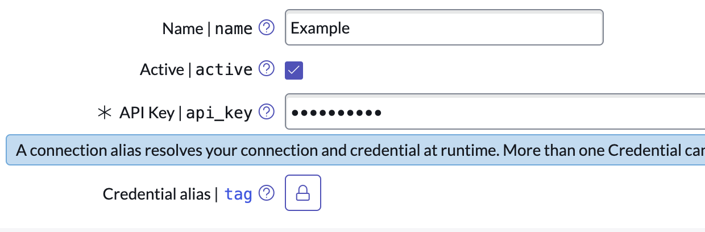

## Problem

Sometimes you've entered in a value into a password field, or other masked field (API keys, etc.), and you need to read it back out.



## Solution

You can use the `.getDecryptedValue()` method to read out the values of masked fields in ServiceNow.

```javascript
var grCr = new GlideRecord('api_key_credentials');
grCr.get('5d0a3863873f12d04259c8c30cbb35dc');
gs.info(grCr.api_key.getDecryptedValue());

// Output: 1234567890
```
