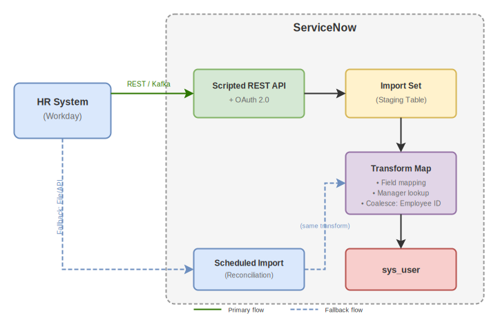

# ServiceNow Integration Design: A CTA Cheat Sheet

This cheat sheet provides a structured approach to integration design for ServiceNow Certified Technical Architects (CTAs) and aspiring architects. It presents a sequence of critical questions that build upon each other, guiding you through the decision-making process for designing robust, scalable, and maintainable integrations.

---

## The Integration Design Decision Framework

### Question 1: What is the Business Requirement?

**Why this matters:** Before diving into technical decisions, you must understand _what_ problem you're solving and _why_. Integration for integration's sake leads to technical debt.

**Key considerations:**

-   What business process does this integration enable or improve?
-   What data needs to flow, in which direction, and how often?
-   What are the SLAs for data freshness and availability?
-   What happens if the integration fails?

**CTA Insight:** During the CTA exam, you'll encounter scenarios where "integration complexity reveals data lifecycle concerns." Pattern recognition in architectural thinking is essential—always trace back to business value.

> **Reference:** [ServiceNow CTA Program](https://learning.servicenow.com/expertprograms/en/pages/expert-program?id=snpx_home&type=CTA)

---

### Question 2: Is There a Native Solution Available?

**Why this matters:** Custom development should be your last resort. Native solutions are tested, supported, and upgrade-safe.

**Decision path:**

1. **Check the ServiceNow Store** — Pre-built spokes and connectors exist for common platforms (Salesforce, Microsoft Teams, AWS, Jira, etc.)
2. **Integration Hub Spokes** — 180+ pre-built spokes provide low-code integration options
3. **Zero Copy Connectors** — For data virtualization without replication (Snowflake, Databricks, BigQuery, Oracle, etc.)

**When to go custom:**

-   No native solution exists
-   Native solution doesn't meet specific requirements
-   Performance requirements exceed native capabilities

> **References:**
>
> -   [Integration Hub Spokes and How to Build Them](https://www.servicenow.com/community/workflow-data-fabric-blog/integration-hub-spokes-and-how-to-build-them/ba-p/2788254)
> -   [Zero Copy Connectors](https://www.servicenow.com/community/workflow-data-fabric-articles/zero-copy-connectors-are-here-unlock-real-time-enterprise-data/ta-p/3302004)

---

### Question 3: Should Data Persist in ServiceNow?

**Why this matters:** Data replication decisions have profound implications for storage costs, data governance, compliance, and system performance.

**Choose Data Persistence (Copy) when:**

-   Data is needed for reporting and analytics
-   Offline access is required
-   Complex joins with ServiceNow data are needed
-   Historical data retention is required

**Choose Zero Copy / Data Virtualization when:**

-   Very high data volume or change velocity
-   Legal/compliance constraints on data residency
-   Data ownership must remain with source system
-   Real-time accuracy is paramount

**ServiceNow Options:**
| Approach | Use Case |
|----------|----------|
| **Import Sets + Transform Maps** | Bulk data loads with transformation |
| **Table API** | Direct record manipulation |
| **Zero Copy Connectors** | Real-time access without replication |
| **Data Fabric Tables** | Unified access to internal and external data |

> **Reference:** [Integration Design Decision Tree](https://www.servicenow.com/community/architect-blog/integration-design-how-to-choose-the-best-pattern-to-integrate/ba-p/2874114)

---

### Question 4: Which System Initiates the Integration?

**Why this matters:** The initiating system determines the integration pattern, authentication flow, and where error handling logic resides.

**ServiceNow Initiates (Outbound):**

-   Use REST/SOAP messages, Integration Hub actions
-   Scheduled jobs, event-driven flows, or user-triggered
-   Control timing and payload structure

**External System Initiates (Inbound):**

-   Expose Scripted REST APIs or Table APIs
-   Implement webhooks
-   Consider Import Set API for bulk operations

**Bidirectional (eBonding):**

-   Both systems can initiate
-   Requires correlation IDs to prevent loops
-   Consider Instance Data Replication (IDR) or Service Bridge for ServiceNow-to-ServiceNow

> **Reference:** [eBonding Best Practices](https://www.servicenow.com/community/architect-forum/best-practices-for-architecting-ebonding-integrations-in/m-p/3057257)

---

### Question 5: Does the Integration Cross Network Boundaries?

**Why this matters:** Network topology determines whether a MID Server is required and impacts security architecture.

**MID Server Required when:**

-   Target system is behind a firewall (internal network)
-   No direct internet access to target
-   Security policy prohibits direct cloud-to-on-premise traffic

**MID Server NOT Required when:**

-   Target is a public cloud service
-   Target has a public API endpoint
-   Communication is already handled by Integration Hub spoke

**MID Server Best Practices:**

-   Place MID Servers logically close to target systems (same data center)
-   Task each MID Server with a single use (discovery, orchestration, integration)
-   Multiple MID Servers per network segment to avoid firewall traversal
-   Force traffic through secure outbound proxy for logging/inspection
-   Use credential vaults (CyberArk, HashiCorp) for secrets management

> **References:**
>
> -   [What is a ServiceNow MID Server](https://www.servicenow.com/content/dam/servicenow-assets/public/en-us/doc-type/success/quick-answer/mid-server-basics.pdf)
> -   [MID Server Use Cases Discussion](https://www.servicenow.com/community/api-insights-forum/integration-mid-server-usecase/m-p/3215226)

---

### Question 6: What Protocol Should Be Used?

**Why this matters:** Protocol choice affects interoperability, development effort, and long-term maintainability.

**Decision Hierarchy (in order of preference):**

| Priority | Protocol                    | When to Use                                                  |
| -------- | --------------------------- | ------------------------------------------------------------ |
| 1        | **REST (JSON)**             | Default choice—most widely adopted, flexible, lightweight    |
| 2        | **GraphQL**                 | When data efficiency is critical (selective field retrieval) |
| 3        | **SOAP (XML)**              | Only when integrating with legacy systems that require it    |
| 4        | **Event Streaming (Kafka)** | When EDA already exists; use Stream Connect                  |
| 5        | **File-based**              | Fallback only—treat as legacy pattern                        |
| 6        | **Email/RPA**               | Last resort—treat as temporary solutions                     |

**ServiceNow-to-ServiceNow Options:**

-   **Instance Data Replication (IDR)** — Real-time data syncing
-   **Service Bridge** — Process alignment for MSP/Telco scenarios
-   **Remote Process Sync (RPS)** — Cross-instance workflow coordination
-   **Remote Instance Spoke** — Ad hoc Integration Hub connections

> **Reference:** [Integration Design - How to Choose the Best Pattern](https://www.servicenow.com/community/architect-blog/integration-design-how-to-choose-the-best-pattern-to-integrate/ba-p/2874114)

---

### Question 7: Should Processing Be Synchronous or Asynchronous?

**Why this matters:** This decision impacts user experience, system resource utilization, and error handling complexity.

**Choose Synchronous when:**

-   Immediate response is required
-   Transaction is simple and fast (<5 seconds)
-   User is waiting for the result
-   Downstream process depends on immediate confirmation

**Choose Asynchronous when:**

-   Processing may take significant time
-   High volume of transactions
-   Target system has variable response times
-   Improved scalability is needed

**Asynchronous Implementation Options:**

-   `RESTMessageV2.executeAsync()` / `SOAPMessageV2.executeAsync()`
-   ECC Queue for MID Server operations
-   Flow Designer subflows with async behavior
-   Import Set API with async transform mode
-   Scheduled jobs for batch processing

**Performance Warning:** Async Business Rules consume Scheduler Workers (limited to 8). Monitor frequency and duration.

> **References:**
>
> -   [Unpacking Asynchronous Integration](https://www.servicenow.com/community/developer-blog/unpacking-asynchronous-integration-execution-vs-transaction-in/ba-p/3284344)
> -   [Different Ways to Implement Asynchronous Inbound APIs](https://www.servicenow.com/community/developer-blog/different-ways-to-implement-asynchronous-inbound-apis-in/ba-p/3285420)

---

### Question 8: Integration Hub or Scripted Approach?

**Why this matters:** This determines the skill set required for maintenance, governance capabilities, and long-term agility.

**Integration Hub Advantages:**

-   Low-code/no-code visual development
-   Built-in error handling and retry policies
-   Centralized monitoring and execution tracking
-   Pre-built spokes for common platforms
-   Easier maintenance by non-developers
-   Consistent governance across integrations

**Scripted REST/SOAP Advantages:**

-   Maximum flexibility and customization
-   No additional licensing costs
-   Fine-grained control over payloads
-   Complex conditional logic
-   When requirements exceed spoke capabilities

**Best Practice: Hybrid Approach**
Use Integration Hub for standard patterns and Scripted REST for specialized requirements. For inbound webhooks, expose via Scripted REST API with proper authentication.

> **References:**
>
> -   [Why Integration Hub over REST Message?](https://www.servicenow.com/community/developer-forum/why-we-should-go-with-integration-hub-for-integration-rather/m-p/2693847)
> -   [Integration Hub vs Scripted REST API](https://nowcompiler.com/integration-hub-vs-scripted-rest-api-choosing-the-right-servicenow-integration-approach/)

---

### Question 9: How Should Inbound Data Be Processed?

**Why this matters:** Your choice affects data validation, transformation capabilities, debugging, and scalability.

**Import Set API + Transform Maps (Recommended for bulk/complex):**

-   Data validation via transform scripts
-   Field mapping with source scripts
-   Coalesce fields for upsert behavior
-   Staging table for debugging ("input rows")
-   Handles nested/complex JSON structures
-   Synchronous or asynchronous processing

**Table API (Direct manipulation):**

-   Simple CRUD operations
-   No transformation needed
-   Lower latency for simple operations
-   Less control over validation

**Scripted REST API (Custom endpoints):**

-   Complete control over processing logic
-   Custom response formats
-   Complex business logic at ingestion
-   Combine with Import Sets for best of both

> **References:**
>
> -   [Import Set API - Goodbye SRAPIs?](https://www.servicenow.com/community/developer-articles/import-set-api-goodbye-srapis/ta-p/2318624)
> -   [When to use Data Source/Transforms instead of Flow Designer](https://www.servicenow.com/community/servicenow-ai-platform-forum/when-to-use-data-source-transforms-instead-of-flow-designer/m-p/1136713)

---

### Question 10: What Authentication Method Is Appropriate?

**Why this matters:** Authentication decisions impact security posture, credential management complexity, and compliance.

**Authentication Options (in order of security):**

| Method                | Security Level | Use Case                                         |
| --------------------- | -------------- | ------------------------------------------------ |
| **Mutual TLS (mTLS)** | Highest        | Regulated industries, high-security environments |
| **OAuth 2.0**         | High           | Modern APIs, delegated authorization             |
| **API Key/Token**     | Medium         | Simple integrations, controlled access           |
| **Basic Auth**        | Lower          | Legacy systems, internal only                    |

**Mutual TLS Considerations:**

-   Requires certificate exchange and management
-   For inbound mTLS: Submit HI ticket to enable on instance
-   Use MID Server for outbound mTLS to internal systems

**Best Practices:**

-   Store credentials in Credential records (encrypted in keystore)
-   Never hardcode credentials in scripts
-   Use vault integrations (CyberArk, HashiCorp) when possible
-   Rotate credentials regularly

> **References:**
>
> -   [Set up Certificate-based Authentication](https://docs.servicenow.com/en-US/bundle/vancouver-platform-security/page/integrate/authentication/task/set-up-mutual-auth.html)
> -   [Mutual Authentication for Instance-to-Instance](https://www.servicenow.com/community/developer-blog/set-up-mutual-authentication-for-servicenow-instance-to-instance/ba-p/3334094)

---

### Question 11: How Will Errors Be Handled?

**Why this matters:** Robust error handling determines whether integrations fail gracefully or create cascading problems.

**Error Handling Strategy:**

1. **Retry Policies** (for transient errors: 408, 500, 502, 504):

    - **Exponential Backoff** — Double wait time between retries
    - **Fixed Interval** — Consistent delay between attempts
    - **Honor Retry-After Header** — Respect server guidance

2. **Circuit Breaker Pattern:**

    - Track consecutive failures
    - "Open" circuit after threshold to prevent resource exhaustion
    - Allow test calls after timeout period

3. **Idempotency Design:**

    - Use idempotency keys (`X-Idempotency-Key` header)
    - Track processed transactions in custom log table
    - Return appropriate HTTP codes: 200 (processed), 409 (in-progress), 500 (error)
    - Use Import Set coalescing for upsert behavior

4. **Logging and Monitoring:**
    - Custom logging tables for integration payloads
    - Store request/response, status, timestamps
    - Alert on error rate thresholds

> **References:**
>
> -   [Designing for Idempotency in ServiceNow](https://www.servicenow.com/community/developer-articles/designing-for-idempotency-in-servicenow-integration-flows/ta-p/3314549)
> -   [Flow and Action Error Handling](https://www.servicenow.com/community/workflow-automation-articles/flow-and-action-error-handling-level-1-retry-and-action-error/ta-p/2877930)
> -   [Handling HTTP Errors in Integrations](https://www.servicenow.com/community/api-insights-articles/handling-http-errors-in-servicenow-integrations-a-comprehensive/ta-p/3066241)

---

### Question 12: How Will Rate Limits and Scalability Be Addressed?

**Why this matters:** Uncontrolled API traffic can degrade instance performance for all users.

**ServiceNow Rate Limiting Concepts:**

-   Governed by system resources AND subscription-based limits
-   Semaphores control parallel transaction limits
-   `API_INT` semaphore pool: default 4 simultaneous threads
-   Node count affects overall capacity

**Scalability Patterns:**

| Challenge          | Solution                             |
| ------------------ | ------------------------------------ |
| High volume        | Async processing via ECC queue       |
| Burst traffic      | Queue-based buffering, rate limiting |
| Multiple endpoints | Message bus / ESB architecture       |
| Large payloads     | Pagination, chunking                 |
| Continuous polling | Event-driven webhooks instead        |

**Best Practices:**

-   Use async messages via ECC queue to avoid prolonged resource consumption
-   Implement rate limiting on custom APIs
-   Monitor semaphore utilization
-   Consider message bus for 20+ integration endpoints

> **References:**
>
> -   [Understanding ServiceNow REST API Rate Limits](https://www.servicenow.com/community/developer-articles/understanding-servicenow-rest-api-rate-limits-key-concepts-amp/ta-p/3407367)
> -   [Overcoming Hurdles to Integration Scalability](https://www.servicenow.com/community/knowledge-blog/overcoming-hurdles-to-integration-scalability/ba-p/2282084)

---

### Question 13: Is an ESB/Middleware Necessary?

**Why this matters:** Middleware introduces complexity but provides powerful orchestration and governance capabilities.

**Consider ESB/Middleware when:**

-   20+ integration endpoints exist
-   Complex message transformation required
-   Orchestration across multiple systems
-   Centralized logging and monitoring needed
-   Protocol translation required
-   Message queuing/buffering needed

**Skip Middleware when:**

-   Few, simple integrations
-   Direct point-to-point is sufficient
-   Native spokes handle requirements
-   Added latency is unacceptable

**Pattern Evolution:**

```
Point-to-Point → Hub & Spoke → ESB → API Gateway → Event-Driven
```

> **Reference:** [Modernizing Integration Architecture for Telecommunications](https://www.servicenow.com/community/developer-blog/modernizing-integration-architecture-for-telecommunications/ba-p/3395042)

---

### Question 14: What About AI Agent Integrations?

**Why this matters:** AI agents introduce new patterns and considerations distinct from traditional integrations.

**AI Integration Patterns:**

1. **REST/Web Services** — Clear contracts, predictable schemas (recommended for regulated workflows)
2. **MCP (Model Context Protocol)** — Dynamic but variable
3. **A2A (Agent-to-Agent)** — Direct agent communication
4. **Agentic Spokes** — Integration Hub actions for AI

**Key Consideration:** For regulated or deterministic workflows, prefer REST for its "clear contracts and predictable schemas" over dynamic agent behavior.

> **Reference:** [Integration Design Decision Tree](https://www.servicenow.com/community/architect-blog/integration-design-how-to-choose-the-best-pattern-to-integrate/ba-p/2874114)

---

### Question 15: Is Event-Driven Architecture Appropriate?

**Why this matters:** Event-driven architecture (EDA) decouples producers and consumers, enabling real-time responsiveness and improved scalability. As more organizations adopt Kafka-based platforms, this pattern becomes foundational for digital operations.

**What is Event-Driven Integration?**

In traditional request/response integration, System A directly calls System B and waits for an answer—a synchronous, tightly coupled conversation. Event-driven integration flips this model: instead of asking, systems announce.

When something significant happens (an incident is created, an asset is retired, a user is onboarded), the source system publishes an **event**—a lightweight message describing what occurred. This event is placed onto a **message broker** (like Apache Kafka), which acts as a central distribution hub. Any system interested in that event type subscribes to receive it. The publisher doesn't know or care who's listening; the subscribers don't need to poll or wait.

This creates **loose coupling**: producers and consumers operate independently, can scale separately, and failures in one don't cascade to others. It also enables **real-time reactivity**—subscribers process events as they arrive, not on a polling schedule.

**Consider EDA / Stream Connect when:**

-   Organization already has Kafka infrastructure
-   Real-time event processing is required
-   High-volume, continuous data streams exist
-   Loose coupling between systems is desired
-   Multiple consumers need the same events

**Stream Connect Capabilities:**

| Direction                          | Implementation                                          | Use Case                                       |
| ---------------------------------- | ------------------------------------------------------- | ---------------------------------------------- |
| **Producing** (ServiceNow → Kafka) | Kafka Producer Step in Flow Designer, ProducerV2 API    | Stream ServiceNow events to external consumers |
| **Consuming** (Kafka → ServiceNow) | Kafka Message Trigger in Flow Designer, Script Consumer | React to external events in real-time          |

**Architecture Considerations:**

-   **High Availability**: Primary/standby cluster architecture with automatic failover
-   **Performance**: Up to 2MB/second production rate, 32 partitions per topic
-   **Ports**: Producers use 4000-4050; Consumers use 4100-4150 and 4200-4250
-   **No middleware required**: Stream Connect enables native Kafka integration

**When NOT to use EDA:**

-   Simple request/response patterns suffice
-   No existing Kafka infrastructure (overhead to establish)
-   Strict transactional consistency required
-   Low-volume, infrequent data exchanges

> **References:**
>
> -   [Stream Connect for Apache Kafka - Product Page](https://www.servicenow.com/products/stream-connect-for-apache-kafka.html)
> -   [Stream Connect Implementation Tips](https://www.servicenow.com/community/workflow-data-fabric-blog/stream-connect-implementation-tips/ba-p/3420184)
> -   [Stream Connect for Apache Kafka FAQ](https://www.servicenow.com/community/automation-engine-blog/stream-connect-for-apache-kafka-faq/ba-p/2601776)
> -   [Stream Connect Documentation](https://docs.servicenow.com/en-US/bundle/vancouver-integrate-applications/page/administer/integrationhub/concept/stream-connect-apache-kafka.html)

---

### Question 16: Is a UI-Level Integration Needed?

**Why this matters:** Sometimes the integration requirement is about user experience rather than data exchange. UI-level integrations embed ServiceNow functionality directly into external applications or vice versa.

**UI Integration Options:**

| Option                   | Use Case                                             | Considerations                                     |
| ------------------------ | ---------------------------------------------------- | -------------------------------------------------- |
| **Engagement Messenger** | Embed chat/support widget in external websites       | CSM-focused, JavaScript embed, OIDC auth supported |
| **Mobile SDK**           | Native iOS/Android app integration                   | Requires mobile development expertise              |
| **iFrame**               | Embed external content in ServiceNow (or vice versa) | Security concerns, last resort option              |

**Engagement Messenger:**

-   Embeds ServiceNow Virtual Agent and support capabilities into external websites
-   Enables visitors to get information without navigating to ServiceNow directly
-   Can be placed in Service Portal via widget HTML
-   Supports OIDC authentication for secure contexts
-   Limited customization—extensive modifications not recommended

**Mobile SDK:**

-   Build native iOS/Android apps that integrate with ServiceNow
-   Embed Engagement Messenger in mobile applications
-   Requires native mobile development skills (Swift, Kotlin)
-   Best for organizations with dedicated mobile development teams

**iFrame Embedding:**

-   **Use with caution**: Security vulnerabilities (clickjacking, XSS)
-   Cross-origin restrictions may block functionality
-   May require `glide.set_x_frame_options` configuration
-   Consider as last resort when other options don't fit

**When to Choose UI Integration:**

-   End users shouldn't leave their current application
-   Self-service capabilities needed on external sites
-   Mobile app requires ServiceNow data/functionality
-   Portal consolidation requirements

> **References:**
>
> -   [Transform Your Site with Engagement Messenger](https://www.servicenow.com/community/csm-articles/transform-your-site-with-engagement-messenger-deliver/ta-p/2768487)
> -   [Configure Engagement Messenger](https://www.servicenow.com/docs/bundle/washingtondc-customer-service-management/page/product/customer-service-management/task/create-engagement-messenger-module.html)
> -   [Features of Engagement Messenger](https://www.servicenow.com/docs/bundle/washingtondc-customer-service-management/page/product/customer-service-management/concept/features-of-engagement-messenger.html)

---

### Question 17: Are Fallback Solutions Required?

**Why this matters:** Not all systems offer modern integration options. Legacy systems, vendor limitations, or organizational constraints may force you to consider fallback approaches. Understanding when these are appropriate—and their limitations—is essential for CTAs.

**The Fallback Hierarchy (use only when necessary):**

| Fallback            | When to Use                                           | Limitations                                                   |
| ------------------- | ----------------------------------------------------- | ------------------------------------------------------------- |
| **File-based**      | Legacy systems with FTP/SFTP only, batch data exports | No real-time, error handling complexity, storage overhead     |
| **Email**           | "Lowest common denominator" when nothing else works   | Parsing unreliability, security concerns, no transactionality |
| **RPA**             | UI-only systems with no API                           | Brittle (UI changes break bots), resource-intensive, slower   |
| **ServiceNow Lens** | Manual data entry from images/screenshots             | User-initiated, not automated integration                     |

**File-Based Integration:**

-   Connect to FTP sites or pull files via MID Server
-   Use scheduled imports with Data Sources
-   Appropriate for batch processes where real-time isn't needed
-   Requires robust error handling for malformed files

**Email Integration:**

-   Bidirectional email is a standard ServiceNow capability
-   Use when target system literally has no other interface
-   Parsing logic is fragile—email format changes break integration
-   Consider for notifications, not critical data exchange

**RPA (Robotic Process Automation):**

-   **Use when APIs don't exist**: "If you have the option to use an API to integrate, that is preferable above using RPA"
-   Mimics human clicks using UI screen captures
-   Two types: **Unattended (RPA)** for fully automated, rule-driven processes; **Attended (RDA)** for human-assisted workflows
-   Best for: onboarding/offboarding, legacy mainframe interactions
-   Build with RPA Hub and Desktop Design Studio

**ServiceNow Lens:**

-   Desktop application (Windows/Mac) that uses Vision LLM
-   Extracts data from screenshots, dashboards, handwritten notes
-   Auto-fills ServiceNow form fields from visual data
-   User-initiated—not an automated integration pattern
-   Requires `lens_user` role

**Key Principle:** Fallback solutions should be treated as temporary bridges, not permanent architecture. Always document a migration path to modern integration patterns when possible.

> **References:**
>
> -   [ServiceNow RPA: An Introduction](https://www.servicenow.com/community/developer-articles/servicenow-rpa-an-introduction/ta-p/2686301)
> -   [RPA Data Integration Blog](https://www.servicenow.com/blogs/2023/robotic-process-automation-data-integration)
> -   [What is ServiceNow Lens](https://www.servicenow.com/community/workflow-data-fabric-articles/what-is-servicenow-lens-transform-visual-data/ta-p/3249484)
> -   [ServiceNow Lens Documentation](https://www.servicenow.com/docs/bundle/yokohama-integrate-applications/page/product/servicenow-lens/concept/servicenow-lens-landing-page.html)
> -   [Loading Data from Email Attachments](https://www.servicenow.com/community/developer-blog/loading-data-from-an-email-attachment/ba-p/2279728)

---

## The 9 Architectural Patterns Reference

Understanding these foundational patterns helps CTAs communicate integration approaches:

| Pattern              | Description                          | ServiceNow Example                     |
| -------------------- | ------------------------------------ | -------------------------------------- |
| **Peer-to-Peer**     | Direct communication, no coordinator | Direct REST API calls                  |
| **API Gateway**      | Single entry point for all clients   | Custom Scripted REST APIs              |
| **Pub-Sub**          | Decoupled publishers and subscribers | Stream Connect, Event-driven flows     |
| **Request-Response** | Synchronous call/reply               | Standard REST integration              |
| **Event Sourcing**   | Store state changes as events        | Audit logging, timeline reconstruction |
| **ETL**              | Extract, Transform, Load             | Import Sets + Transform Maps           |
| **Batching**         | Accumulate before processing         | Scheduled imports                      |
| **Streaming**        | Real-time continuous processing      | Stream Connect with Kafka              |
| **Orchestration**    | Central coordinator manages workflow | Flow Designer, Workflow Editor         |

> **Reference:** [Top 9 Architectural Patterns for Data and Communication Flow](https://www.servicenow.com/community/developer-forum/top-9-architectural-patterns-for-data-and-communication-flow/m-p/2901430)

---

## Integration Design Checklist

Use this checklist during design reviews:

### Planning

-   [ ] Business requirement clearly defined
-   [ ] Data flow direction(s) documented
-   [ ] SLAs for data freshness established
-   [ ] Failure scenarios identified
-   [ ] Fallback options identified (if API unavailable)

### Architecture

-   [ ] Native solution evaluated first
-   [ ] Data persistence decision justified
-   [ ] Network topology mapped
-   [ ] MID Server requirements identified
-   [ ] Protocol selection documented
-   [ ] Event-driven architecture evaluated (if Kafka exists)
-   [ ] UI integration needs assessed

### Implementation

-   [ ] Authentication method selected
-   [ ] Error handling strategy defined
-   [ ] Retry policies configured
-   [ ] Idempotency implemented where needed
-   [ ] Rate limiting considered

### Operations

-   [ ] Monitoring and alerting configured
-   [ ] Logging strategy implemented
-   [ ] Runbook for common failures created
-   [ ] Upgrade impact assessed

---

## Quick Reference: Decision Flow

```
1. Business Need → What problem are we solving?
       ↓
2. Native Solution? → Check Store, Spokes, Zero Copy
       ↓
3. Data Persistence? → Copy vs. Virtualize
       ↓
4. Initiating System? → Inbound vs. Outbound vs. Both
       ↓
5. Network Boundary? → MID Server required?
       ↓
6. Protocol? → REST (default) vs. alternatives
       ↓
7. Sync vs. Async? → User experience vs. scalability
       ↓
8. Implementation? → Integration Hub vs. Scripted
       ↓
9. Data Processing? → Import Sets vs. Direct API
       ↓
10. Authentication? → mTLS > OAuth > API Key > Basic
       ↓
11. Error Handling? → Retry + Circuit Breaker + Idempotency
       ↓
12. Scalability? → Rate limits + async + monitoring
       ↓
13. ESB/Middleware? → When 20+ endpoints or complex orchestration
       ↓
14. AI Agents? → REST for deterministic, MCP/A2A for dynamic
       ↓
15. Event-Driven? → Stream Connect if Kafka infrastructure exists
       ↓
16. UI Integration? → Engagement Messenger, Mobile SDK, iFrame
       ↓
17. Fallback Needed? → File/Email/RPA only when no API exists
```

---

## Further Reading

### Official ServiceNow Resources

-   [CTA Exam Blueprint](https://learning.servicenow.com/lxp/en/credentials/certified-technical-architect-cta-exam-blueprint?id=kb_article_view&sysparm_article=KB0012670)
-   [Integration Hub Documentation](https://docs.servicenow.com/bundle/quebec-servicenow-platform/page/administer/integrationhub/concept/integrationhub.html)
-   [REST APIs Documentation](https://docs.servicenow.com/en-US/bundle/vancouver-api-reference/page/integrate/inbound-rest/concept/c_RESTAPI.html)
-   [Workflow Data Fabric](https://www.servicenow.com/now-platform/workflow-data-fabric.html)

### Community Articles

-   [Service Bus Design Pattern in ServiceNow](https://www.servicenow.com/community/developer-forum/service-bus-design-pattern-in-servicenow-reusable-scalable/m-p/3192926)
-   [Adapter Design Pattern Guide](https://www.servicenow.com/community/developer-forum/adapter-design-pattern-explained-practical-guide-for-servicenow/m-p/3353485)
-   [BRY Framework for Scalable Solutions](https://www.servicenow.com/community/architect-forum/architecture-servicenow-the-right-way-introducing-the-bry/td-p/3311150)
-   [Aligning ServiceNow Architecture with TOGAF](https://www.servicenow.com/community/developer-blog/aligning-servicenow-architecture-blueprint-with-togaf-standard/ba-p/3464009)

### CTA Preparation

-   [CTA Program Overview](https://learning.servicenow.com/expertprograms/en/pages/expert-program?id=snpx_home&type=CTA)
-   [How I Passed the CTA Exams](https://www.servicenow.com/community/architect-articles/how-i-passed-the-servicenow-cta-certified-technical-architect/ta-p/3444410)
-   [CTA Journey Personal Experience](https://www.servicenow.com/community/training-and-certifications/servicenow-certified-technical-architect-journey-and-personal/ta-p/2303776)
-   [SNReady](https://snready.com) — Practice questions for CTA and 18 other ServiceNow certifications, sourced from official Now Learning content

---

## Worked Example: HR to ITSM Employee Sync

**Scenario:** _Employee data from an HR system must reflect in real-time in ITSM. How would you design the integration?_

Let's walk through the framework systematically.

---

### Q1: Business Requirement

The requirement is clear but let's sharpen it:

- **Data flowing:** Employee records (name, department, manager, title, employment status, location)
- **Direction:** HR → ServiceNow (one-way)
- **Freshness SLA:** "Real-time" — clarify with stakeholders. True real-time (<1 minute) or near-real-time (<15 minutes)? This affects architecture significantly.
- **Failure impact:** Delayed user provisioning blocks onboarding; stale manager data breaks approvals. This is business-critical.

**Architectural decision:** Design for sub-minute latency with graceful degradation to batch as fallback.

---

### Q2: Native Solution?

First question: _What HR system?_

- **Workday** — Integration Hub spoke exists (Workday Spoke)
- **SAP SuccessFactors** — Spoke available
- **Oracle HCM** — Spoke available
- **Custom/Legacy HR** — No spoke; custom integration required

**Architectural decision:** If a spoke exists, evaluate it first. Spokes provide pre-built actions, error handling, and are upgrade-safe. Only go custom if the spoke doesn't meet the real-time requirement or lacks needed fields.

---

### Q3: Data Persistence?

Employee data must persist in ServiceNow. This is not a virtualization candidate because:

- User records (`sys_user`) are referenced across all ITSM processes
- Approvals, assignments, and workflows depend on local user data
- Reporting and analytics require historical records
- Offline access during HR system maintenance is essential

**Architectural decision:** Persist to `sys_user` table. Use Import Sets for staging and transformation.

---

### Q4: Initiating System?

Two options:

| Approach | Latency | Resource Usage | Complexity |
|----------|---------|----------------|------------|
| ServiceNow polls HR | Minutes (polling interval) | Wasteful | Lower |
| HR pushes to ServiceNow | Seconds | Efficient | Higher (HR must support) |

Real-time requirement rules out polling. HR system must push changes as they occur.

**Architectural decision:** HR initiates. Expose an inbound API on ServiceNow that HR calls when employee data changes.

---

### Q5: Network Boundary?

- **HR is SaaS (Workday, SuccessFactors):** Direct HTTPS to ServiceNow instance. No MID Server.
- **HR is on-premise:** MID Server required. Place it in the same network segment as HR system.

**Architectural decision:** Confirm HR system topology. If on-prem, provision MID Server with dedicated purpose (HR integration only).

---

### Q6: Protocol?

HR system capabilities dictate this:

- **Modern HR SaaS:** REST with JSON — preferred
- **Kafka infrastructure exists:** Stream Connect — ideal for true real-time
- **Legacy HR:** SOAP or file-based — accept as constraint

**Architectural decision:** REST/JSON as primary. If organization has Kafka and HR publishes employee events to it, use Stream Connect for superior decoupling and replay capability.

---

### Q7: Sync vs Async?

Consider what HR system needs back:

- Does HR need confirmation of successful sync? → Synchronous
- Is fire-and-forget acceptable? → Asynchronous

For employee data, HR typically doesn't wait for ServiceNow confirmation. Async provides better scalability and handles ServiceNow maintenance windows gracefully.

**Architectural decision:** Asynchronous. HR pushes to ServiceNow, receives 202 Accepted, processing happens in background.

---

### Q8: Integration Hub or Scripted?

| Factor | Integration Hub | Scripted REST |
|--------|-----------------|---------------|
| Monitoring | Built-in execution history | Custom logging needed |
| Error handling | Configurable retry policies | Manual implementation |
| Maintenance | Low-code, accessible | Requires developers |
| Flexibility | Constrained by spoke design | Unlimited |

**Architectural decision:** Hybrid approach.

- Expose **Scripted REST API** as inbound endpoint (for custom payload handling and authentication)
- Trigger **Flow Designer subflow** for processing (for monitoring and reusability)
- Use **Import Set API** internally for transformation

---

### Q9: Inbound Data Processing?

Import Set API with Transform Maps is ideal here:

- **Staging table:** Debug incoming data, audit history
- **Transform scripts:** Handle field mapping, data cleansing
- **Coalesce field:** Employee ID — enables upsert (update if exists, insert if new)
- **Error rows:** Capture and alert on transformation failures

**Architectural decision:**

```
HR System → Scripted REST API → Import Set API → Transform Map → sys_user
```

The Transform Map handles:
- Mapping HR fields to ServiceNow fields
- Manager lookups (HR manager ID → ServiceNow sys_user reference)
- Department/location resolution
- Employment status → active flag

---

### Q10: Authentication?

For inbound from HR:

| Method | When to Use |
|--------|-------------|
| OAuth 2.0 | Modern HR SaaS, delegated authorization |
| mTLS | Regulated industry, highest security requirement |
| API Key | Simpler setups, controlled network |

**Architectural decision:** OAuth 2.0 with client credentials grant. HR system authenticates as service account with limited scope (write to staging table only). Store credentials in ServiceNow Credential record.

---

### Q11: Error Handling?

Design for resilience:

1. **Idempotency:** Use Employee ID as idempotency key. Duplicate pushes result in updates, not duplicates.

2. **Retry guidance:** Return `Retry-After` header on 503/429 responses.

3. **Dead letter handling:** Failed transforms write to error table with full payload for manual review.

4. **Alerting:** Event rule triggers on error threshold (>5 failures in 10 minutes).

**Architectural decision:** Import Set coalescing provides natural idempotency. Add custom error logging table for failed records with automated incident creation.

---

### Q12: Rate Limits and Scalability?

Consider peak scenarios:

- **Normal:** 50-100 changes/day
- **Acquisition/Reorg:** 10,000+ changes in hours
- **Monday morning:** Burst of weekend changes

**Architectural decision:**

- Async processing handles bursts via ECC queue
- For bulk events (acquisition), HR sends batch file; switch to scheduled import
- Monitor Import Set queue depth; alert if backlog exceeds threshold

---

### Q13: ESB/Middleware?

For a single HR→ServiceNow integration: **No.**

If HR data also feeds:
- Active Directory
- Payroll systems
- Badge access systems
- Multiple ServiceNow instances

Then consider middleware for fan-out. HR publishes once; middleware distributes.

**Architectural decision:** Direct integration unless HR data feeds 5+ systems. Revisit if integration landscape expands.

---

### Q14: AI Agents?

Not applicable. Employee data sync is deterministic — no AI decision-making required.

---

### Q15: Event-Driven Architecture?

**If Kafka exists:** This is the ideal pattern.

```
HR System → Kafka Topic (employee.events) → Stream Connect → ServiceNow
```

Benefits:
- HR doesn't need to know ServiceNow endpoint
- Replay capability if ServiceNow was down
- Other systems can subscribe to same topic
- True real-time with loose coupling

**If no Kafka:** Webhooks are acceptable. HR calls ServiceNow REST endpoint directly.

**Architectural decision:** Recommend Stream Connect if Kafka infrastructure exists or is planned. Otherwise, webhook with async processing.

---

### Q16: UI Integration?

Not applicable. This is a backend data sync, not a user-facing integration.

---

### Q17: Fallback?

What if real-time integration fails?

**Fallback design:**
- Scheduled job runs every 4 hours
- Pulls full employee extract via HR API (or SFTP file)
- Processes via same Transform Map
- Catches anything missed by real-time sync

This provides resilience without duplicating transformation logic.

**Architectural decision:** Implement scheduled reconciliation job as safety net. Same Import Set table, same Transform Map, different data source.

---

### Final Architecture Summary



**Key decisions summarized:**

| Question | Decision |
|----------|----------|
| Native solution | Use spoke if available; custom REST if not |
| Data persistence | Yes — sys_user table |
| Initiator | HR system pushes |
| MID Server | Only if HR is on-premise |
| Protocol | REST/JSON or Stream Connect |
| Processing | Asynchronous |
| Implementation | Scripted REST → Import Set → Transform Map |
| Authentication | OAuth 2.0 |
| Error handling | Coalesce for idempotency, error table + alerting |
| Fallback | Scheduled reconciliation job |

This design provides sub-minute latency under normal conditions, graceful handling of bulk events, and resilience through scheduled fallback — meeting the "real-time" requirement while maintaining architectural integrity.

---

_This cheat sheet is based primarily on official ServiceNow documentation and community resources. Integration patterns and best practices evolve with each platform release—always verify against current documentation._
